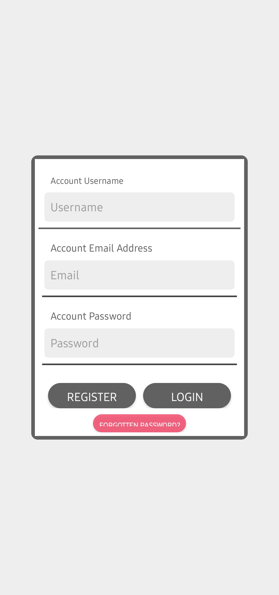
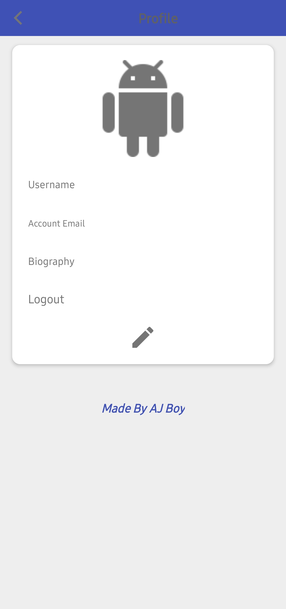

# Chatroom Android App

  

A modern Android chat application that enables real-time messaging and file sharing between users. Built with Firebase for real-time data synchronization and secure authentication.

## Installation

Download the latest APK from the [Releases](../../releases) section and install it on your Android device.

## Screenshots

  
  
  

## Features

- Real-time messaging
- Private chat rooms
- File and image sharing
- User profiles
- Firebase Authentication
- Modern Material Design UI

## Technical Details

- **Development Platform**: Built using Sketchware, a mobile app development tool that enables creating Android apps directly on Android devices
- **Platform**: Android
- **Backend**: Firebase Realtime Database
- **Storage**: Firebase Cloud Storage
- **Authentication**: Firebase Auth
- **Minimum SDK Version**: Android 9.0 (API Level 28)

## Required Permissions

- Internet access
- Network state access
- Read external storage
- Write external storage

## Components

### Activities

- `MainActivity`: Handles user authentication and initial setup
- `BlueActivity`: Main chat interface
- `RedActivity`: Alternative chat interface with different styling
- `PrivateUserChatActivity`: Handles private messaging between users
- `ProfileActivity`: User profile management
- `DebugActivity`: Development debugging interface

### Key Features

1. **Real-time Messaging**
   - Instant message delivery
   - Message status indicators
   - Support for text messages

2. **File Sharing**
   - Image sharing support
   - File attachment functionality
   - Progress indicators for uploads

3. **User Management**
   - User authentication
   - Profile customization
   - Online status tracking

## Dependencies

- Firebase Authentication
- Firebase Realtime Database
- Firebase Cloud Storage
- Google Play Services
- AndroidX Support Libraries

## Security

The application implements secure communication using Firebase security rules and proper authentication mechanisms. All file transfers and messages are handled securely through Firebase's infrastructure.

## Contributing

Feel free to submit issues and enhancement requests.
